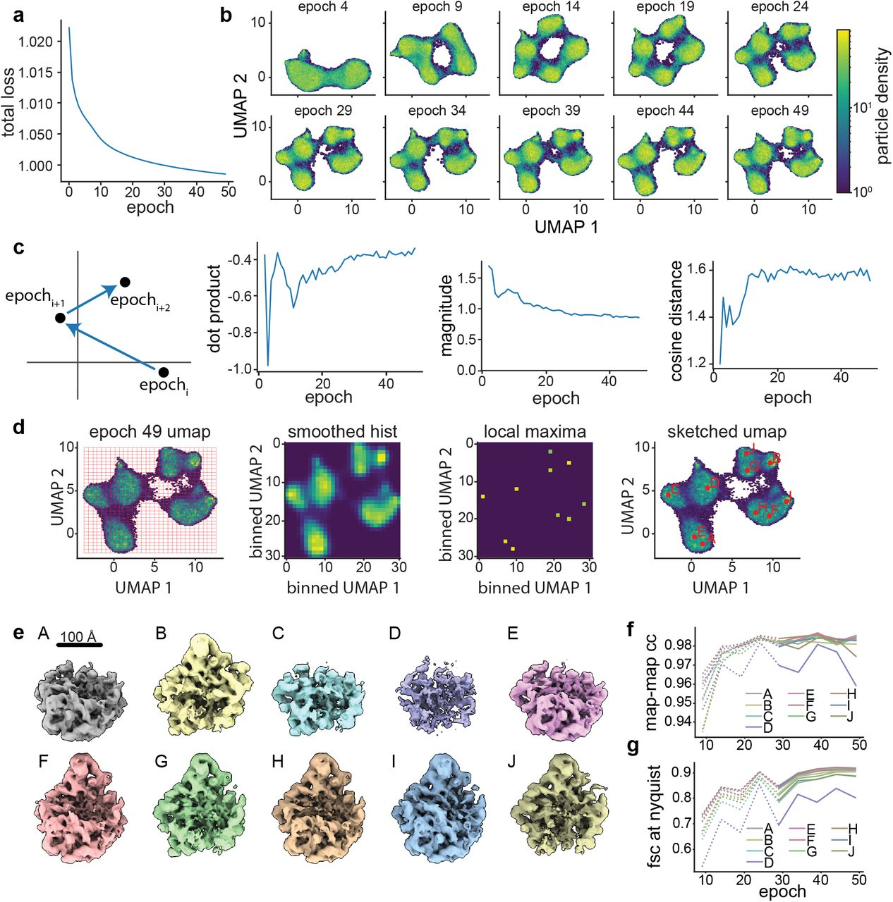
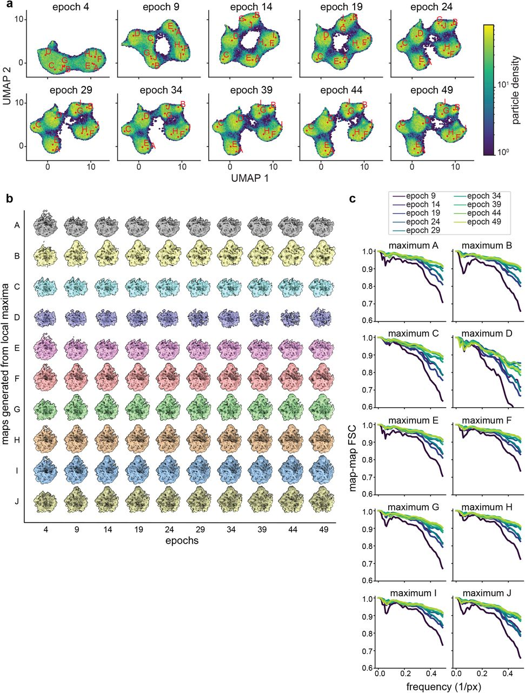

## Current challenges
* Existing cryo-EM tools for hetergeneous reconsturction makes limiting assumptions on the observed structural heterogeneity.
* Requires a priori knowledge of heterogeneity

## Goal
* Continuous **heterogeneous** reconstruction
* A general approach for analysing structural heterogeneity in macromolecular complexes of varying size and *expected sources of heterogeneity*
* $ab\ initio$ heterogeneous reconstruction?
	* More expensive pose search
	* possible in CryoDRGN2, tailored for pose search with tractable computation
 
## Methods
* Neural network to learn heterogeneous ensembles of cryo-EM density maps
	* Instead of approximating a single volume $\hat{V}: \mathbb{R}^{3} \to \mathbb{R}$, cryoDRGN proposes a deep generative model to approximate the function $\hat{V}: \mathbb{R}^{3+n} \to \mathbb{R}$

### CryoDRGN Image Encoder $q_\xi ( \mathbf{z} | X )$
* Observed image $X$ are generated from projections of $V$ at some unknown random pose $\mathbf{R} \in SO(3)$.
* Assume that *volume heterogeneity* is generated from a continuous latent space $\mathbf{z}$
	* so does volume heterogeniety here refer to $X$ , a projection of $V$ at a random pose?
* We would like to approximate the true posterior $p(\mathbf{z}|X)$, which projects the volume heterogeneity $X$ into the latent space $\mathbf{z}$, by using a tractable distribution $q(\mathbf{z})$
	* We choose Gaussian to be the approximating distribution $q(\mathbf{z})$
	* We would like to train a neural network (encoder) parameterised by $\xi$ that predicts $(\mu_{\mathbf{z}|X},\ \Sigma_{\mathbf{z}|X})$ for the Gaussian $q(\mathbf{z})$
		* $q_\xi (\mathbf{z}) = \mathcal{N}(\mathbf{z}\ |\ NNet(\xi))$

### CryoDRGN Volume Decoder $p_\theta(V|\mathbf{k}, \mathbf{z})$
* We would like to approximate a probablistic distribution $p_\theta(V|\mathbf{k}, \mathbf{z})$ for volume $V(\mathbf{k}, \mathbf{z})$
	* $p_\theta(V|\mathbf{k}, \mathbf{z}) = \mathcal{N}(V\ |\ NNet(\theta))$
* A positionally encoded MLP
	* Three hidden layers
 
#### Positional encoding
$$
\mathbf{pe}^{i}(\mathbf{k}) =
\begin{bmatrix}
	\sin \Big(k_x D\pi(\frac{2}{D})^{\frac{i}{\frac{D}{2}-1}}\Big) &
	\cos \Big(k_x D\pi(\frac{2}{D})^{\frac{i}{\frac{D}{2}-1}}\Big) \\
	\sin \Big(k_y D\pi(\frac{2}{D})^{\frac{i}{\frac{D}{2}-1}}\Big) &
	\cos \Big(k_y D\pi(\frac{2}{D})^{\frac{i}{\frac{D}{2}-1}}\Big) \\
	\sin \Big(k_z D\pi(\frac{2}{D})^{\frac{i}{\frac{D}{2}-1}}\Big) &
	\cos \Big(k_z D\pi(\frac{2}{D})^{\frac{i}{\frac{D}{2}-1}}\Big)
\end{bmatrix}
$$
* $i \in \{0, \ldots, \frac{D}{2} - 1 \}$
* $D$ is the number of pixels along one dimension (image size of $D \times D$)
* $\mathbf{k} \in \mathbb{R}^3$ is the 3-D Cartesian coordinates to encode
	* Does $\mathbf{k}$ reside in the voxel $(-0.5, 0.5)^3$?

#### Volume decoder
* *$V(\mathbf{z}, \mathbf{pe}^i(\mathbf{k})) = V\Big([ \mathbf{z},\ \mathbf{pe}^i(\mathbf{k}) ]\Big)$
* Quote from the paper:
	 > ...Because <u>2D projection images can be related to volumes as 2D central slices in Fourier space</u>, oriented 3D coordinates ($\mathbf{k}$?) for a given image ($\mathbf{X}$) can be obtained by rotating _a D_ × _D_ lattice spanning $(−0.5, 0.5)^2$ originally on the _x_–_y_ plane by $\mathbf{R}$, the orientation of the volume during imaging. Then, given a sample ($\mathbf{z}$) out of $q_\xi(\mathbf{z}|X)$ and the oriented coordinates ($\mathbf{k}$), an image $\hat{X}$ can be reconstructed pixel by pixel through the decoder. The reconstructed image is then translated by the image’s in-plane shift and <u>multiplied by the contrast transfer function (CTF)</u> before it is compared to the input image. <u>The negative log likelihood of a given image under our model is computed as the mean square error</u> between the reconstructed image and the input image...*

	* The underlined parts confuse me

#### VAE ELBO Loss
$$
\begin{align*}
	\mathcal{L}(\theta, \xi | X)
	&= ELBO \\
	&= - \mathbb{E}_{\mathbf{z} \sim q_\xi ( \mathbf{z} | X ) }
	\log \Big(
		\frac{q_\xi ( \mathbf{z} | X )}{p_\theta(X, \mathbf{z})}
	\Big)
	\\
	&= \mathbb{E}_{\mathbf{z} \sim q_\xi ( \mathbf{z} | X ) } \Big[\log p_\theta (X|\mathbf{z})\Big]
	- \beta KL \Big( q_\xi ( \mathbf{z} | X )\ ||\ p(\mathbf{z}) \Big)
\end{align*}
$$
where $p(\mathbf{z})$ is the latent prior $\mathcal{N}(\mathbf{0}, \mathbf{I})$
* To those new to VAE: the KL divergence in the regularising term is not the KL divergence between the approximating posterior and the true posterior; it happens to be a KL divergence inside the ELBO term, which is part of the KL divergence between the approximating distribution and the true posterior.

### $ab\ initio$ Heterogeneous Reconstruction
* Requires the knowledge of pose $\mathbf{R}$ to compute $\mathbf{k}$
	* CryoDRGN much more expensive to evaluate than other methods
		* briefly mentioned in the webinar, hardly discussed in the paper
	* or estimated by spatial L-VAE, CryoPoseNet, CryoGAN, CryoAI...
* Pose-supervision (will we still call it *ab initio*?)

### Homogeneous Reconstruction
* Still requires poses estimated in other software packages

### Density Map Generation
* Generated by the trained decoder $V(\mathbf{z}, \mathbf{k})$
	* Performs *k-means* on the latent space to partition into $k$ regions
	* Generate $k$ representative density maps

### Convergence Heuristics

* Total network loss (a)
* UMAP latent embeddings (b):
	* The distribution of latent embeddings (d) is expected to be insensitive to further training
		* High dimensional latent distributions visualised via UMAP embeddings
			* Criteria: number, size, and relative distribution of clusters remaining constant
* Latent embedding shift (c)
	* examines the "movement" of particles in latent space during training
		* movement: The latent difference vectors between successive epochs
		* monitored by three paramters:
			* Size
				* Magnitude of a latent vector
			* Consistency of direction
				* Dot product of a pair of latent vectors between successive epochs
				* Cosine distance of a pair of latent vectors between successive epochs
		* The *medians* for these three paramters across all particles are calculated per epoch, plotted as in (c)
		* upon encoder's convergence, such movements will be small and randomly directed within local minima, consistent asymptotic behaviour (less volatile in later epochs I presume)
* Correlation of generated volumes (f, g)
	* **UMAP local maxima method** (d)
		* Identify a set of latent coordinates representing diverse particles
		1. Latent space binned with 30 bins per axis, results in a 2-D histogram
		2. The 2-D histogram is smoothed with a Gaussian kernel of width = 1 bin
		3. Identify all local maxima
		4. Prune the local maximum with lower amplitude between the two local maxima within a defined radius of each other (not shown in the figure)
		5. In this example it returns 10 largest local maxima A-J, arranged in order of decreasing particle count
		6. The on-data (data point that is clostest to the query coordinate) median latent coordinate of particles within a 3x3 grid of binds centered on each local maximum is returned for volume generation (e)
		7. Such volumes are generated every 5 epochs
			
	 * Volumes generated from UMAP local maxima are expected to trend towards high correlations with the previously generated volume on convergence
		 * Assumption: Particles map to increasingly consistent regions of latent space
		 * Hence decoder produces increasingly consistent corresponding volumes
	* Map-to-map real space correlation coefficients (need to check what this metric is) (f)
	* Map-to-map FSC for volumes of UMAP local maxima (g)

## Innovations

### Existing works for hetergeneous reconstruction
* *Discrete classification* approach:
	* make limiting assumptions on the observed structural heterogeneity
		* heterogeneity is modeled as though it originates from a small number of independent, discrete states
	* implemented as *3D classification* or *heterogeneous refinement* in many cryo-EM software packages
		* Require specifying initial models(?) for refinement
	* error-prone and omits potentially relevant structures because the number + nature of the underlying structural states is unknown a priori
	* ill-suited for reconstructing structures undergoing continuous conformational changes

#### RELION
* Multibody refinement
	* models the structure as the sum of user-defined rigid bodies allowed to rotate relative to one another
		* Place structural assumptions on the observed heterogenity

#### CryoSPARC
* 3D Variability Analysis
	* linear subspace model, PCA-based approach to describe *continuous heterogeneity*
	* the visualised heterogeneity contains artifacts when linear interpolations along basis volumes poorly approximate the conformational deformation of a molecule (?)

#### CryoDRGN
* Unsupervised (but pose-supervised) reconsturction for continuous structural heterogeneity

## Limitations
**Under what circumstances will their method fail?**

## References
1. Zhong, E.D., Bepler, T., Berger, B. _et al._ CryoDRGN: reconstruction of heterogeneous cryo-EM structures using neural networks. _Nat Methods_ **18**, 176–185 (2021). https://doi.org/10.1038/s41592-020-01049-4
2. Uncovering structural ensembles from single particle cryo-EM data using cryoDRGN. Laurel F. Kinman, Barrett M. Powell, Ellen D. Zhong, Bonnie Berger, Joseph H. Davis. bioRxiv 2022.08.09.503342; doi: https://doi.org/10.1101/2022.08.09.503342
3. Zhong, E. D. (2022). _Machine Learning for Reconstructing Dynamic Protein Structures from Cryo-EM Images_ (Doctoral dissertation, Massachusetts Institute of Technology).