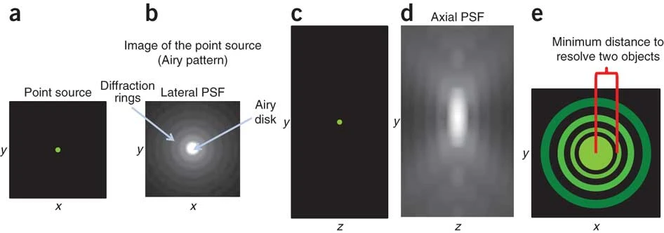

## Image Formation Model
The generation of image $X: \mathbb{R}^2 \to \mathbb{R}$ can be modeled as
$$
\DeclareMathOperator*{\PSF}{PSF}
\begin{align*}
	X(r_x, r_y) &= \PSF \circledast\ T_t \int_{\mathbb{R}} V(R^\top \mathbf{r})dr_z + \epsilon\\
	\mathbf{r} &= [r_x,\ r_y,\ r_z]^\top
\end{align*}
$$
* $V$: the density volume
* $\mathbf{R} \in SO(3)$: the 3-D rotation group, an unknown orientation of $V$
* $T_t$: an unknown in-plane translation by $t \in \mathbb{R}^2$
	* corresponding to imperfect centering of the volume within the image
* $\PSF$: the **point spread function** for the microscope before being corrupted with additive noise and registered on a discrete grid of image size $D \times D$
* The image is the convolution product of the specimen with the $\PSF$

Note that the Fourier transform of a covolution product becomes a normal multiplicative product:

## Point Spread Function (PSF)
### Basic Concepts
To empirically measure the PSF of a microscope, consider imaging a fluorescent bead as a point source whose size is below the resolutional limit of the micropscope:

The lateral (x-y) optical image of the bead (b) shows that the bright centre is surrounded by dark and light concentric rings. The intensity bright centre has a Gaussian-like distribution (e), where the bead resides in the centre of the Gaussian. This lateral image of the point spread function in (b) is referred to as the Airy disk.

The PSF is a result of diffraction and interference. The light collected from the point source diffracts as it passes through the back aperture of the objective lens, bringing about a 3-dimensional interference pattern the PSF describes.

The size of the PSF generally refers to the size of the bright centre (maxima). An image of a point source of light appears as a PSF in the image. As the PSF gets bigger, for two point sources of light, their Gaussian will blur together, losing the ability to resolve the two objects (e).

### TEM Imaging

## References
1. Zhong, E. D. (2022). _Machine Learning for Reconstructing Dynamic Protein Structures from Cryo-EM Images_ (Doctoral dissertation, Massachusetts Institute of Technology).
2. [slaclab](https://github.com/slaclab)/**[cryoEM-notebooks](https://github.com/slaclab/cryoEM-notebooks)**